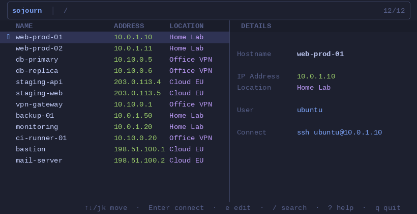
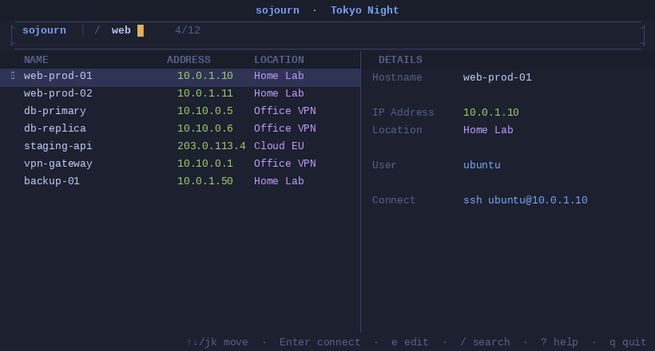
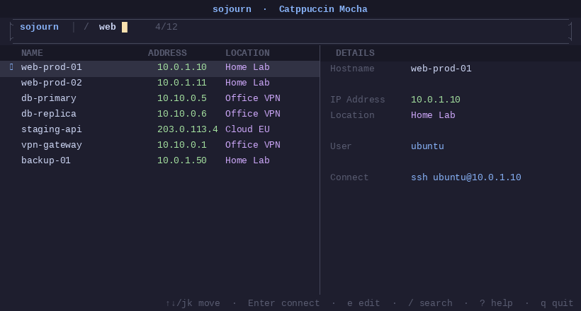
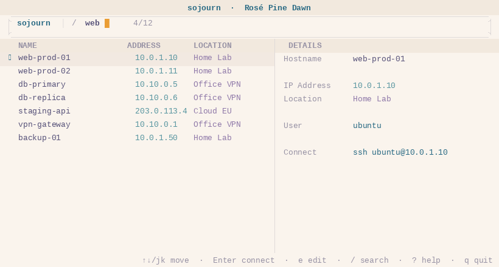

# sojourn

> *sojourn* /ˈsoʊdʒərn/ — a temporary stay in a place. Because every shell session is just passing through.

**A fast, minimal TUI for managing SSH hosts — built in Rust.**

Fuzzy-search across thousands of hosts from your SSH config, Ansible inventories, shell aliases, or YAML files. Hit Enter. You're in.



---

## Install

```bash
curl -fsSL https://raw.githubusercontent.com/marschall-sh/sojourn/main/install.sh | bash
```

Installs to `~/.local/bin`. Supports **macOS (Apple Silicon)**, **Linux (x86-64)**, and **Linux (arm64)**.

Or build from source (requires [Rust](https://rustup.rs/)):

```bash
cargo install --git https://github.com/marschall-sh/sojourn
```

On first run, sojourn scans your system for SSH hosts automatically and walks you through a short setup wizard.

---

## What it does

- **Fuzzy search** across all your hosts as you type — hostname, IP, group, tag
- **Multiple inventory sources** — SSH config (`~/.ssh/config`), Ansible inventories, shell aliases (`.zshrc`/`.bashrc`), custom YAML
- **IP range labels** — map `10.0.*` → `Home Lab`, `10.10.*` → `Office VPN`
- **Jump host support** — auto-wires `ProxyJump` based on host patterns
- **Multi-select** — open connections to several hosts at once
- **9 built-in themes** — six dark, three light
- **First-run wizard** — auto-discovers your inventories, no manual config needed

---

## Keybindings

| Key | Action |
|-----|--------|
| `/` or start typing | Search hosts |
| `↑↓` / `j` `k` | Navigate list |
| `Enter` | SSH connect |
| `Space` | Multi-select |
| `e` | Edit host (user, label, jump host) |
| `Ctrl+A` / `Ctrl+D` | Select all / clear selection |
| `?` | Help overlay |
| `q` | Quit |

---

## Config

Create `~/.config/sojourn/config.toml`:

```toml
[settings]
default_user = "ubuntu"
theme = "tokyo-night"           # default | tokyo-night | catppuccin | dracula | gruvbox | nord
connect_on_single_match = true

[[inventory]]
type = "ssh_config"
path = "~/.ssh/config"

[[inventory]]
type = "ansible"
path = "~/infra/inventories/*/hosts*"

[[ip_labels]]
pattern = "10.0.*"
label   = "Home Lab"

[[ip_labels]]
pattern = "10.10.*"
label   = "Office VPN"
```

See [`config.example.toml`](config.example.toml) for all options including YAML inventories, jump host rules, and host overrides.

---

## Themes

Nine themes ship out of the box — six dark, three light. Set `theme` in your config:

```toml
# dark
theme = "tokyo-night"       # also: default · catppuccin · dracula · gruvbox · nord
# light
theme = "solarized-light"   # also: catppuccin-latte · rose-pine-dawn
```

<table>
<tr>
<td></td>
<td></td>
<td></td>
</tr>
</table>

[→ See all 9 themes](assets/themes-preview.png)

---

## Uninstall

```bash
rm ~/.local/bin/sojourn
rm -rf ~/.config/sojourn/
```

---

## License

MIT — see [LICENSE](LICENSE)
